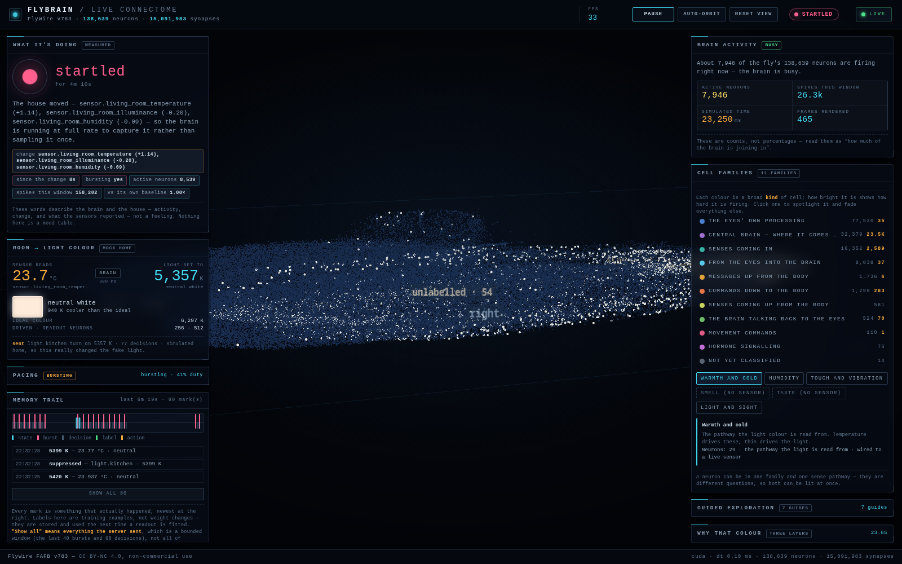
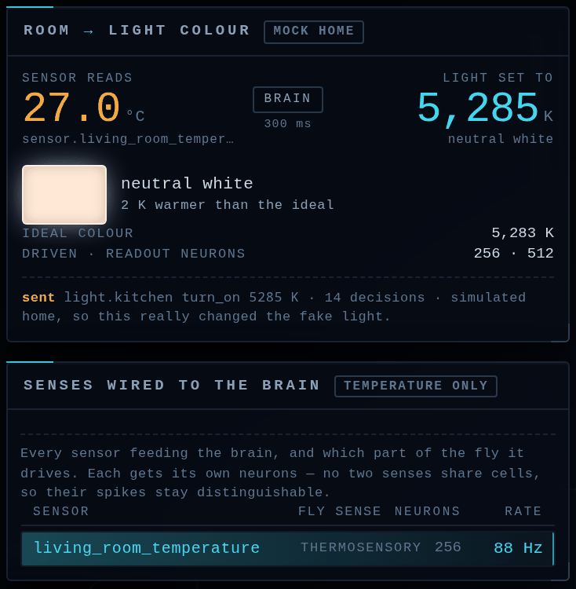

# FlyBrain

**A whole fruit-fly brain, wired to a house.**

This runs the **FlyWire v783** connectome — 138,639 neurons and 15,091,983 synapses from an
adult female *Drosophila* — as a spiking neural network on a consumer GPU, and puts
Home Assistant on both ends of it. A room thermometer drives the fly's real thermosensory
neurons; the spikes that come out are read by a small trained readout; the colour it chooses is
sent back to a lamp.

The brain is **frozen and never learns**. Only a linear readout on top of it is trained. Nothing
in a fly brain knows what a kitchen light is — that mapping is ours, and the code says so.




Every dot in the middle is one neuron, brightening as it fires. Around it: what the room reads,
what colour the brain chose, which senses are wired in, and how much of the brain is joining in.

---

## What it actually does

```
room sensor (°C) → rate-coded drive → 138,639-neuron connectome (frozen) → spike rates
                                                                              ↓
                          light.turn_on (colour temperature K) ← trained linear readout
```

One decision consumes a **300 ms window of brain time**, which costs about **2.3 seconds of GPU
work** — the simulator currently runs at **0.13× realtime**. Measured end to end against the
ideal mapping: **31 K mean error, 104 K worst case, correlation 0.9971**.

That error sounds large next to a colour temperature, but it is **~1% of the 3800 K span** —
below what anyone can see on a lamp.



The panel names the **biological pathway**, not a config key: a thermometer really does drive the
fly's `thermosensory` neurons, motion drives `visual`, sound drives `mechanosensory`. That naming
is the whole point — it is the difference between "an ML model looks at a sensor" and "a fly's
thermosensory neurons are being stimulated".

**A real home does not swing 23 °C.** The dashboard's *Sensitivity* control stretches whatever
range your sensor actually produces onto the range the brain was trained on, so a two-degree room
swing can still drive the whole colour range.

## Quick start

Needs an NVIDIA GPU (it runs, but crawls, without one), Python 3.11, and [`uv`](https://docs.astral.sh/uv/).

```bash
git clone https://github.com/aliforfaen/FlyBrain.git
cd FlyBrain
uv sync                          # creates .venv with torch + CUDA wheels

.venv/bin/python tools/fetch_data.py     # downloads the connectome (~140 MB, one time)
.venv/bin/python -m flybrain.experiment  # trains the colour readout, ~50 s
.venv/bin/python -m flybrain.server      # dashboard + live control loop
# → http://127.0.0.1:8765/
```

The loop runs against a **simulated home** by default, so it works with nothing configured — the
temperature swings between about 11 °C and 34 °C on a three-minute cycle and you can watch the
light follow it within a minute.

```bash
.venv/bin/python -m pytest tests/ -q      # 523 passing, 3 skipped, no connectome needed
.venv/bin/python -m flybrain.wiring       # propose a pathway map for your own house
```

### Pointing it at a real house

Copy `.env.example` to `.env` (gitignored) and fill in your Home Assistant URL, a long-lived
token, and the entity ids you want to use. `.env` is loaded automatically at startup; real
environment variables still win, so `FLYBRAIN_INTERVAL_S=15 .venv/bin/python -m flybrain.server`
overrides the file.

**`HA_DRY_RUN=1` is the default and keeps a real Home Assistant strictly read-only** — the loop
logs what it *would* send and changes nothing. Leave it on until you trust it; this project was
developed against a live house and never wrote a single state.

## Which connectome this is

| | |
|---|---|
| Dataset | **FlyWire v783** — whole adult female *Drosophila* brain (FAFB) |
| Neurons | **138,639** |
| Synapses | **15,091,983** directed (pre, post) pairs |
| Annotation coverage | 138,625 of 138,639 neurons (14 unlabelled) |
| Model | Shiu et al., *Nature* 2024 — leaky integrate-and-fire, `dt = 0.1 ms` |
| Licence | **CC BY-NC 4.0 — non-commercial.** See [`docs/licensing.md`](docs/licensing.md) |

The data is **not committed to this repository** — it is ~140 MB of third-party tables. Running
`tools/fetch_data.py` downloads four files from their public upstreams, anonymously, and verifies
each against its expected byte count:

| File | Size | Source |
|---|---|---|
| Connectivity parquet | 100.8 MB | [`eonsystemspbc/fly-brain`](https://github.com/eonsystemspbc/fly-brain) (mirrors FlyWire v783) |
| Neuron list CSV | 3.5 MB | same |
| Cell-type annotations TSV | 31.7 MB | [`flyconnectome/flywire_annotations`](https://github.com/flyconnectome/flywire_annotations) |
| Soma coordinates | 5.3 MB | FlyWire Codex, public Google Cloud bucket |

What *is* committed is the small trained readout (`data/experiments/`, a few KB) so the demo runs
without retraining, plus the code, tests and documentation.

## The five things worth knowing

1. **`recurrent_scale` is `1.0` and `w_scale_mv` is the published `0.275 mV`.** There is no fudge
   factor. An earlier revision carried a "provisional 0.01" that was cancelling a missing
   `tau_mem` in the membrane update, which made every synapse 20× too strong.

2. **Train and run in the same regime.** The readout is fitted on a *continuous* sweep of an
   already-running brain. A window that starts from rest is a different state, and mixing the two
   silently costs accuracy.

3. **A ~100× fudge factor is a bug report, not a calibration.** Verify arithmetic against a closed
   form on a two-neuron network before touching data.

4. **The simulator is validated against Brian2, not assumed correct.** Three networks, `Jaccard`
   1.000 / 1.000 / 0.964, rate correlation ≥ 0.998. A green result is only meaningful if the thing
   measured is doing something — a previous "PASS" was degenerate, agreeing while producing zero
   recurrent spikes.

5. **The engine, not the physics, is the remaining compromise.** The fix is an active-set
   integrator; batching does not help, because the GPU is already saturated at batch 1.

### Validation against Brian2

| Network | Duration | Synapses | In-deg. | brian2 / ours | Jaccard | Rate corr. |
|---|---|---|---|---|---|---|
| 4,000-neuron augmented slice | 200 ms | 20,000 | 5.0 | 6,868 / 6,870 | 1.000 | 1.000 |
| 20,000-neuron real slice | 150 ms | 318,232 | 15.9 | 5,240 / 5,241 | 1.000 | 1.000 |
| 60,000-neuron real slice | 100 ms | 2,807,417 | 46.8 | 6,370 / 6,418 | 0.964 | 0.998 |

Read the rows as three independent like-for-like comparisons; they are **not** comparable to each
other, because each uses a different duration *and* network density. A hand-checkable micro-test
pins the integrator itself: one synaptic event of weight `w` must deflect the membrane by
`0.15749 × w` mV. For `w = 5 mV` ours measures 0.7874 mV and Brian2 measures 0.7874 mV.

## What it costs to leave running

One decision costs ~2.3 s of GPU work, so the loop is paced by a wall-clock interval rather than
run flat out — the default is one decision every **15 s**. Measured on an RTX 3070:

| Mode | Mean power |
|---|---|
| Flat out | ~165 W |
| One decision every 5 s | ~86 W |
| **One decision every 15 s (the default)** | **~40 W** |
| Paused | ~19 W |

Past a fixed interval, the loop can also **burst on a change**: while it waits, it re-reads the
sensors (free — no GPU time), and if the room moves enough it runs at full rate for a few seconds
to capture the event rather than sample it once. The heartbeat still guarantees a decision either
way, which is what keeps the *quiet* windows coming. Off by default
(`FLYBRAIN_TRIGGER_DELTA`), documented in [`docs/engine.md`](docs/engine.md#idle-cost-and-adaptive-pacing).

CPU stays at 0.1% throughout; this is entirely GPU. Pacing is adjustable live in the
dashboard, and the pause button (or space bar, or `POST /api/pause`) drops the card to idle in
about a second. More in [`docs/engine.md`](docs/engine.md).

## What this is built on

None of this would exist without a lot of other people's work. The pieces:

**Data and science**

- **[FlyWire](https://flywire.ai)** — the connectome. Dorkenwald, S. et al., "Neuronal wiring
  diagram of an adult brain", *Nature* (2024). Licensed **CC BY-NC 4.0**.
- **Shiu, P. K. et al.**, "A leaky integrate-and-fire computational model based on the connectome
  of the entire adult *Drosophila* brain", *Nature* (2024) — the model equations. Reference
  implementation ([`philshiu/Drosophila_brain_model`](https://github.com/philshiu/Drosophila_brain_model))
  is **MIT**; if you want to read the original parameterisation, that is the place.
- **[`eonsystemspbc/fly-brain`](https://github.com/eonsystemspbc/fly-brain)** — commits the v783
  connectivity parquet and completeness CSV to git, which is why no Codex account is needed. The
  repository is GPL-2.0, so **only its data is used, never its code**.
- **[`flyconnectome/flywire_annotations`](https://github.com/flyconnectome/flywire_annotations)**
  — cell typing, by Schlegel et al. and Matsliah et al. (2024). Carries no licence file; attribute
  the papers and do not redistribute it as a product.
- **FlyWire Codex** — soma coordinates, from FlyWire's public Google Cloud bucket.

**Software**

- **[PyTorch](https://pytorch.org)** (BSD-3) — the whole simulation is a sparse matrix multiply
  per timestep.
- **[NumPy](https://numpy.org)**, **[pandas](https://pandas.pydata.org)** / **[PyArrow](https://arrow.apache.org)**
  (BSD-3 / Apache-2.0) — loading and joining the connectome tables.
- **[FastAPI](https://fastapi.tiangolo.com)** and **[uvicorn](https://www.uvicorn.org)** (MIT / BSD-3)
  — the dashboard's HTTP and WebSocket API.
- **[httpx](https://www.python-httpx.org)** (BSD-3) — talking to Home Assistant.
- **[three.js](https://threejs.org)** (MIT) — the 3D brain view. Vendored at `web/vendor/three/`,
  no bundler and no CDN, so the dashboard works offline.
- **[Brian2](https://brian2.readthedocs.io)** (CeCILL-2.1) — the ground-truth simulator this was
  validated against. Development only; it lives in a separate `.venv-validation` because it does
  not support NumPy 2.x.

**Read for ideas, not copied.** Two closely related projects carry **no licence at all**, which
defaults to all rights reserved — [`mattyhempstead/fly-wirehead`](https://github.com/mattyhempstead/fly-wirehead)
and [`cnqso/infinite-sugar`](https://github.com/cnqso/infinite-sugar). Studying them is fine;
copying their code is not, and none of it is in here. [`docs/licensing.md`](docs/licensing.md)
documents the whole audit, including the two other repositories whose MIT code this project
learned from.

## Status

| Piece | State |
|---|---|
| Connectome loading, sparse LIF simulation, GPU | **Working** — ~3 s load, ~184 MB weights, 0.13× realtime |
| Neuron-population mapping | **Working** — 13 roles, 138,625 of 138,639 neurons annotated |
| Live 3D brain view (three.js + binary WebSocket) | **Working** — verified in a browser |
| Temperature → light colour control loop | **Working end to end** — 31 K mean error, corr. 0.9971 |
| Real Home Assistant wiring | **Working, read-only** — `HA_DRY_RUN=1` by default, never writes |
| Second and further senses (motion, light level) | **Built, untrained** — wiring verified, readout not yet re-fitted |
| Brian2 ground-truth validation | **Matching** — Jaccard 1.000 / 1.000 / 0.964 |
| Real-time engine (active-set integrator) | **Not built** — see [`docs/engine.md`](docs/engine.md) |
| Fly vision from a camera stream | **Designed only** — see [`docs/vision.md`](docs/vision.md) |

## Documentation

The interesting parts are the mistakes, so they are written down.

- **[`docs/architecture.md`](docs/architecture.md)** — how it fits together, the model equations,
  and the integrator bug that caused a months-long "recurrent gain" wild goose chase
- **[`docs/live-view.md`](docs/live-view.md)** — the dashboard, the wire protocol, and every
  configuration flag
- **[`docs/engine.md`](docs/engine.md)** — performance, power, and the real-time plan
- **[`docs/data.md`](docs/data.md)** — schemas, provenance, parsing gotchas
- **[`docs/wiring.md`](docs/wiring.md)** — which sensor drives which fly pathway, and why the order
  of those rules matters
- **[`docs/roadmap.md`](docs/roadmap.md)** — what to build next, and what a fly brain is honestly
  good for
- **[`docs/ha-inventory.md`](docs/ha-inventory.md)** — what a real house's Home Assistant actually
  exposes, and which plausible ideas it rules out
- **[`docs/vision.md`](docs/vision.md)** — the camera → visual-column design, **not built**
- **[`docs/licensing.md`](docs/licensing.md)** — **read before shipping anything**
- **[`docs/research/`](docs/research/README.md)** — the asset inventory and the record of dead ends

## Honest limitations

- **It is not realtime.** 0.13× realtime means a 300 ms thought takes 2.3 s of wall clock.
- **A frozen random network is not a classifier.** A fly connectome gives temporal memory,
  nonlinear expansion, and many outputs for one stepping cost. It does not reason or plan, and on
  any single narrow task it loses to a purpose-built model. The honest framing is *context*: let
  Home Assistant do the millisecond reflexes and let the brain supply slow state.
- **The colour bands are arbitrary.** 2700 K / 5000 K / 6500 K were chosen so the output is
  legible, not because a fly has opinions about lighting.
- **It does not model the fly's real senses faithfully.** Motion drives the `visual` population
  crudely, and the readout listens to antennal-lobe neurons rather than descending ones, because
  measurement showed the descending neurons are nearly unreachable from a sensory drive in a
  300 ms window. That compromise is documented, not hidden.

## Licence

**Code: MIT. Data: CC BY-NC 4.0 — non-commercial.**

[`LICENSE`](LICENSE) covers the source code in this repository only. The connectome and
annotation data are **not distributed here** — `tools/fetch_data.py` downloads them — and are
licensed for **non-commercial use only**. Personal and homelab use is fine; do not sell this.
Details, including two popular fly-brain projects that must not be copied from, are in
[`docs/licensing.md`](docs/licensing.md).

## Citation

If you publish anything based on this, cite the data and the model, not this repository:

- Dorkenwald, S. et al. "Neuronal wiring diagram of an adult brain." *Nature* (2024) — FlyWire.
- Shiu, P. K. et al. "A leaky integrate-and-fire computational model based on the connectome of
  the entire adult *Drosophila* brain reveals insights into sensorimotor processing." *Nature* (2024).
- Schlegel, P. et al. (2024) — systematic neuron annotation.
