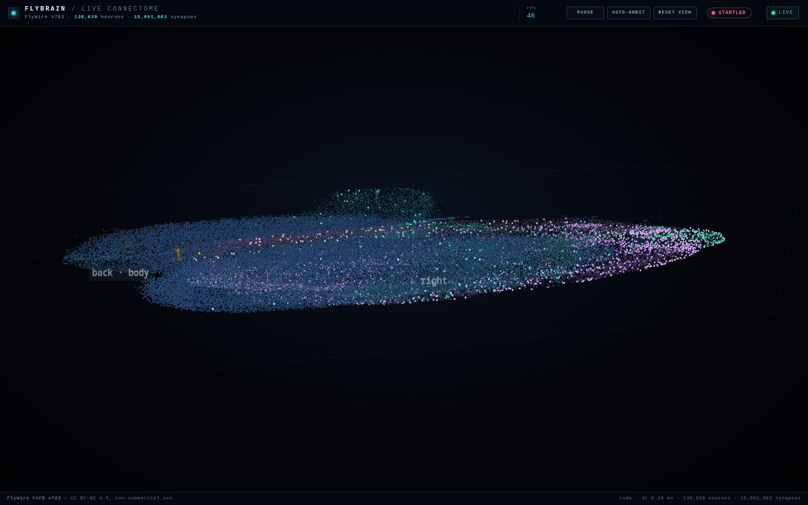
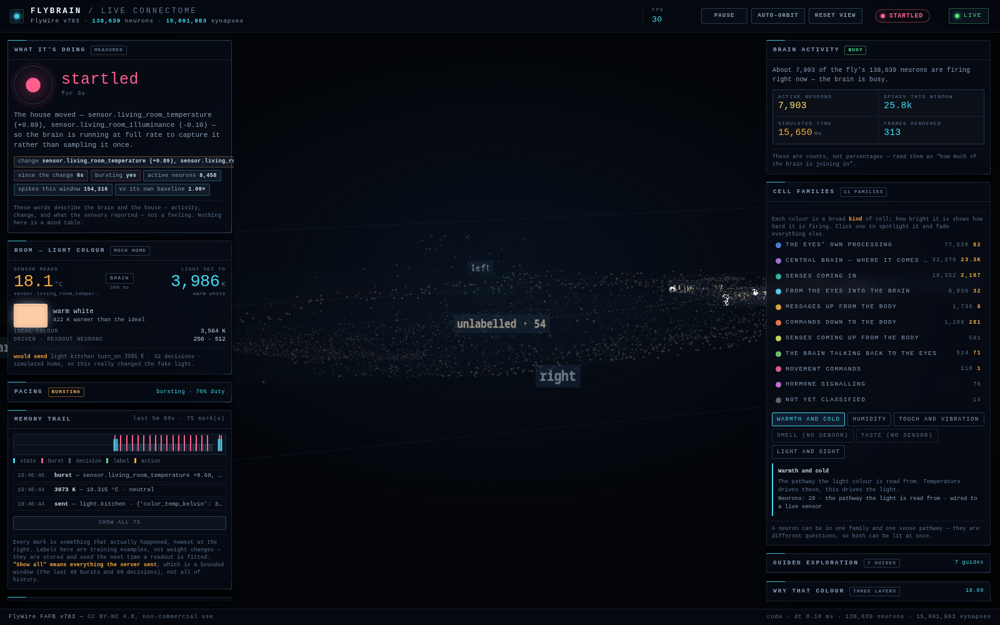
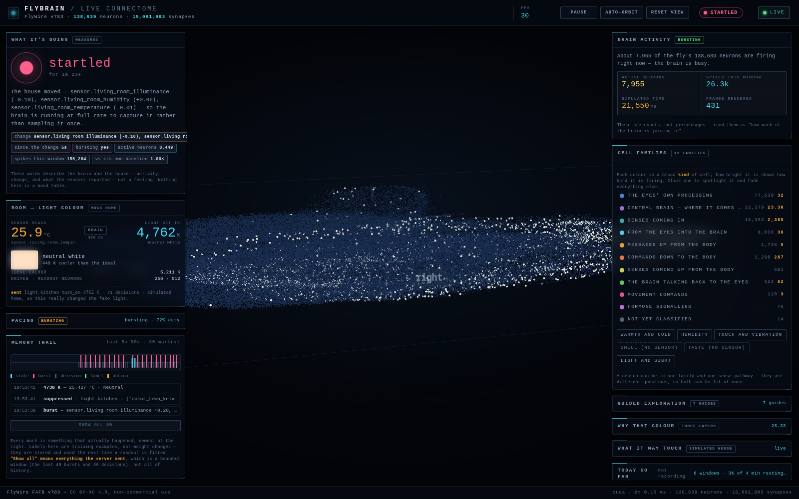

# The live brain view

A local dashboard showing the connectome running: a 3D point cloud of all 138,639 neurons
coloured by live activity, plus panels for activity, usage and settings.

```
.venv/bin/python -m flybrain.server
# open http://127.0.0.1:8765/
```

## The one decision that makes it work

**The browser renders, Python does not paint.** Pushing per-neuron values through a
Python-serialised channel (Bokeh/Panel model sync, Streamlit reruns, Dash props, socket.io
outboxes) is the bottleneck in every comparable project — not the GPU, and not the browser.

So:

- Neuron positions are uploaded to the GPU **once** as a single `THREE.Points` geometry.
- Per frame we send exactly **one `uint8` per neuron** — 139 KB — over a **binary** WebSocket.
- A **GLSL fragment shader** maps intensity to colour on the GPU.

Sending the same data as JSON would be roughly 1 MB per frame plus a 139,000-element
`JSON.parse`, and would cap the dashboard far below its frame budget. Sending per-point RGB
would be 1.7 MB per frame instead of 139 KB.

This mirrors what the research found: the only projects that manage a live fly-brain view at
scale keep a 1-channel quantised intensity buffer and colour it in a shader.

## Data flow

```
ConnectomeSim.step()  ──►  MemoryBrain.advance()  ──►  Frame(intensity uint8[138639])
                                   │
                                   ├── quantize: clip(counts*gain/saturation)^gamma * 255
                                   │
                                   └── server.encode_frame()  ──►  binary WS frame
                                                                        │
                                                        web/app.js ──► THREE.Points
                                                        (ShaderMaterial colormap)
```

`MemoryBrain` lives in `flybrain/activity.py` and wraps the simulator so the dashboard never
touches simulation internals. It exposes exactly what a view needs — a dense intensity buffer,
a sparse list of the most active neurons, and aggregate usage — which is also the seam the fast
engine will slot into later without the frontend changing.

## Wire protocol

`WS /ws/activity`. On connect the server sends one **text** JSON frame:

```json
{"type":"hello","n_neurons":138639,"dt_ms":0.1,"settings":{...},"roles":{...}}
```

Then **binary** frames at `settings.fps` (default 20 Hz):

| Offset | Type | Field |
|---|---|---|
| 0 | uint32 LE | magic `0x4642524E` ("FBRN") |
| 4 | uint32 LE | sequence number |
| 8 | uint32 LE | n_neurons |
| 12 | float32 LE | simulated brain time, ms |
| 16 | uint32 LE | spikes this window |
| 20 | uint32 LE | active neurons this window |
| 24 | uint8 × n | intensity per neuron, 0–255 |

Total for the full connectome: **24 + 138,639 = 138,663 bytes** per frame.

Clients send text JSON: `{"type":"pause","value":true}`, `{"type":"settings","settings":{...}}`,
`{"type":"drive","role":"thermosensory","current_mv":8.0}`, `{"type":"ping"}`.

## HTTP endpoints

| Endpoint | Purpose |
|---|---|
| `GET /api/config` | connectome metadata, role sizes, settings, wire description |
| `GET /api/positions` | raw `Float32Array`, `n*3` — soma positions in normalised units |
| `GET /api/groups` | cell families and sensory pathways with plain-English names, plus where the orientation markers go |
| `GET /api/groups/ids` | raw `Uint8Array`, `n*2` — family id then sense id per neuron, in connectome order |
| `GET /api/regions` | per-cell-class usage (`regions`) **and** per-family usage (`families`) |
| `GET /api/trace` | where one family or sense sends its signals: top target classes, exact synapse counts, group-to-group geometry |
| `GET`/`POST /api/settings` | read / patch the live settings |
| `POST /api/drive` | set or clear a persistent drive on a named role |
| `GET /api/frame` | last frame summary |
| `GET /api/loop` | the control loop's whole state, including pacing and the last action |
| `GET /api/status` | the pet, journal, three layers, pacing state, trust block and Jev status |
| `GET /api/timeline` | the memory trail: state changes, bursts, decisions, labels, actions |
| `GET /api/jev/status` | whether the Jev judgment layer is usable, and if not, *why*. **This is the call that spends** |
| `POST /api/jev` | classify one recorded decision into a failure mode (placement A) |
| `POST /api/jev/enabled` | turn the judgment layer on or off for this process |
| `POST /api/pause` | pause or resume without opening a browser (phone shortcut, cron, HA) |

**`/api/status` deliberately does not probe Jev.** It reports the last known answer, or `unprobed`.
A dashboard that is merely being *looked at* must not spend money, so the one call that costs
anything is the one you ask for.

## Settings that are live-tunable

| Setting | Meaning |
|---|---|
| `gain` | multiplier on spike counts before display quantisation |
| `saturation` | spike count that maps to full brightness |
| `gamma` | <1 lifts dim activity into view |
| `window_ms` | brain time advanced per published frame |
| `fps` | frames published per second |
| `sparse_limit` | how many neurons go into the sparse "recent spikes" list |
| `background_drive_mv`, `background_fraction` | optional random background drive |

The drive control in the UI is the interesting one: point it at `thermosensory` and the fly's
real 29 hot/cold neurons light up, and you can watch activity propagate through the connectome
from there.

## Why the view is not a real-time brain

`ConnectomeSim` runs the full 138,639-neuron network at about **0.13× realtime** on the RTX 3070
(≈7 s of wall time per second of brain time). It cannot be driven at 20 Hz in real time.

The dashboard handles this honestly rather than pretending: it advances a fixed window of brain
time per published frame and displays the result at a comfortable rate, reporting both
`sim_ms` (brain time) and wall-clock FPS, so the ratio is always visible. Brain time and wall
time are deliberately decoupled.

The fix for actual real-time throughput is the **active-set integrator** — integrate only the
neurons that are active rather than sweeping all 138k every 0.1 ms step. See
[research/simulation-backends.md](research/simulation-backends.md).

## Frontend files

```
web/index.html          page shell, import map, styles
web/app.js              WebGL renderer, WebSocket client, panels
web/vendor/three/       three.js 0.186.0 (MIT), vendored locally — no CDN, no bundler
```

three.js is vendored deliberately: this is a local, offline-capable dashboard, and a CDN
dependency would break that.

## Verified end-to-end (2026-09-21)

Checked against the running server, not by inspection:

- `GET /api/config` reports `wire.header_bytes = 24` and `wire.magic = 1178751566`
  (`0x4642524E`). A binary frame is `24 + 138,639 = 138,663` bytes, confirmed on the wire.
- The client reads both values from `/api/config` rather than hard-coding them, so the
  header size and magic cannot silently drift out of sync with the server again.
- `GET /api/positions` returns exactly `n_neurons * 12 = 1,663,668` bytes.
- Pause freezes `seq`; killing the server puts the UI into `reconnecting` with backoff and
  it recovers on restart without a page reload.
- The 3D view was inspected as a screenshot at 1280x800 and 1920x1080: the point cloud is a
  recognisable fly brain, the panels dock around it without hiding it, and the usage table
  populates.

## Two backend bugs found while building the view

Both were silent and are now fixed, with regression tests in `tests/test_sim.py`.

**A drive could never be cleared.** `MemoryBrain.clear_input_drive()` cleared only its own
copy of the indices, while `ConnectomeSim._persistent_drive` kept re-applying the current on
every step. `POST /api/drive {"role": null}` reported success while the population kept
firing forever, and the only recovery was restarting the server. `clear_input_drive()` now
also calls `sim.clear_drive()`.

**The usage panel was racy.** `/api/regions` read `sim._spike_counts_gpu`, but
`MemoryBrain.advance()` had already replaced that tensor with a fresh zero tensor via
`spike_counts(reset=True)`. The endpoint therefore returned an empty list almost every time
and only occasionally caught data. `MemoryBrain` now caches the window's counts, and the
panel reads the cache.

## Note on defaults: a single spike saturates the colormap

With the default `gain = 8.0` and `saturation = 4.0`, one spike quantises to intensity 255 —
so any active neuron renders at full brightness and the activity view looks uniformly white.
Lower the gain or raise the saturation to see a gradient. The UI log-scales those two
controls for exactly this reason. The network is also **silent without a drive**: nothing
fires until you activate a sensory population or set a background drive.

## The control loop

Two pieces, deliberately separate: `flybrain/experiment.py` **trains** the readout offline, and
`flybrain/loop.py` **runs** it against a live sensor. The loop owns no simulator — it is handed
the same `ConnectomeSim` the dashboard is already stepping, so the picture on screen and the
decision being made come from the same running brain, and there is only one copy of a
15-million-synapse network in memory.

```
HA sensor (°C) ─► rate-coded drive ─► frozen FlyWire v783 ─► spike rates on the
readout population ─► learned ridge readout ─► colour temperature (K) ─► HA action
```

Train, then run:

```bash
.venv/bin/python -m flybrain.experiment    # ~50 s, writes data/experiments/
.venv/bin/python -m flybrain.server        # dashboard + live loop
```

### When the sensor stops reporting, the loop stops acting

A missing reading is not a reading of zero. When the configured temperature entity is offline,
`unknown`, absent, or carrying a value that will not parse, the loop now takes no action at all
and clears the drive, so the brain falls quiet rather than being fed its own last input.

Two fields carry that to the dashboard, because a frozen number and a *wrong* number should not
look the same:

| Field | Meaning |
|---|---|
| `reading_stale` | no usable reading in this window; no service call was made |
| `reading_age_s` | seconds since the last usable reading, so the panel can say how old it is |

A stale window still returns an entry, deliberately — the dashboard has to be able to show that
the loop has *stopped* and why. It is simply not appended to the decision history, which stays an
X-Y plot of real decisions rather than acquiring colourless holes. `last_action.reason` is
`sensor_stale` in that case, and `sent` is `false`.

### Training must match the regime the loop runs in

This is the least obvious thing in the whole project, and getting it wrong cost real accuracy.

The readout was originally trained on windows that each began from a **resting** brain. A live
loop never has one: it reads the most recent window of an already-running network. Those are
different states — at these time constants a window that starts from rest is a *transient*,
while a live window is a *steady* driven state — and a linear probe distinguishes them with
**100% accuracy** (`tools/loop_regime_probe.py`).

| trained on | evaluated on | mean abs error |
|---|---|---|
| rest windows | rest windows | 34 K |
| live windows | live windows | 34 K |
| rest windows | **live windows** | 50 K |
| live windows | rest windows | 250 K |

So `TemperatureColourLoop.sweep()` now drives the brain **continuously** through the
temperature range, one window per temperature, exactly as the loop does. The held-out number it
reports is therefore the number the loop will actually achieve, rather than a friendlier one.
It also happens to be cheaper: one continuous sweep costs ~50 s, against ~96 s for the
settle-per-temperature version it replaced.

Offline, `evaluate()` reports held-out temperatures that lie strictly between the training
points: monotone 8/8, correlation 0.9989, **mean error 41 K** (worst 106 K) against a 3800 K
ideal span — the trained range runs from a 2700 K candle-warm to a 6500 K daylight.

But the number that matters is the one the *live loop* achieves, so it is measured directly
(`tools/loop_accuracy.py`): the real `LiveLoop`, the real mock sensor, the brain running
continuously, one full three-minute cycle of the simulated room.

```
decisions 40   mean |err| 31 K   max 104 K   correlation 0.9971
mock service calls sent: 40
```

About 1% of full scale over a range of 11.5–33.5 °C, tracked both on the way up and the way
down — a difference nobody can see on a lamp. The live figure is slightly *better* than the
offline one because a real run visits each temperature with more history behind it.

The error is quoted in Kelvin, which flatters a *wide* range and punishes a narrow one, so
compare it against the span: 41 K on 3800 K and 27 K on 2500 K are the same ~1.1%. Widening
the range costs nothing in relative accuracy and buys a change you can actually see, which is
why the trained range is 2700–6500 K rather than the 4000–6500 K it started as.

> **Do not run the experiment while the dashboard is streaming.** They share the GPU: with a
> browser attached, training took **214 s** instead of 50 s for byte-identical results. The
> figures above are uncontended.

**Four mistakes worth recording**, because each one produced a plausible-looking but wrong
result rather than an obvious crash:

1. `current_per_spike_mv` was far too small. At 0.9 mV the drive never crossed the 7 mV gap to
   threshold, so nothing spiked anywhere and the network was silent.
2. The readout collapsed the population into one scalar per colour band, using a *distinct*
   slice of the pool for each. That fixed an earlier "all bands see the same neurons" bug, but
   it is still the wrong shape: three random slices of one population report almost exactly the
   same thing (r = 0.996–1.000), so the decoder had one effective dimension. The readout now
   takes the firing rate of **every** neuron in the pool and regresses the Kelvin value
   directly. On a held-out split that moved the achievable error from ~155 K to ~20 K.
3. The sensory rate ran from **0 Hz** at the cold end, so the coldest temperature injected no
   current at all and the readout population was completely silent — the solver had literally
   nothing to read, and could only fall back on its bias. Real thermoreceptors have spontaneous
   activity, so the encoder now runs 20–120 Hz.
4. `evaluate()` reused the training temperatures, so its reported error was in-sample fit
   quality presented as accuracy. It now evaluates strictly between training points. The
   *previous* 531 K figure was measured this way and was in fact an optimistic number.

Design detail worth knowing: the readout listens to the antennal-lobe populations
(`antennial_projection`, `antennial_local`) rather than descending/motor neurons, because a
sensory drive cannot reach the latter — a strong drive produced ~23 extra spikes across all
1,299 descending neurons (see `research/simulation-backends.md`). That is a compromise forced by
measurement, not the biologically ideal choice.

## What the dashboard shows

The dashboard was rewritten around the one thing it is for: **a reading goes in, a colour comes
out**. Controls that only changed how the picture was drawn were removed rather than tidied.

Removed: point size, exposure and floor-lift sliders; the colour-mode picker; the manual
sensory-drive panel (the sensor drives the brain now); and the raw simulation-settings panel,
which exposed dataclass fields as sliders. Kept: drag/scroll camera, **Pause** (it shows its own
state) and **Reset view** (a recovery affordance, not a dial).

The HUD now reads:

| Panel | What it is for |
|---|---|
| **What it's doing** | The pet: the state word, its contributors, and a sentence naming what moved |
| **Room → light colour** | The headline. Sensor reading in °C, the colour in Kelvin, a swatch painted in the actual light colour, the ideal for comparison, and the exact Home Assistant call |
| **Colour chosen** | An **X-Y plot**: room temperature on x, chosen colour on y, one point per decision, with the perfect mapping as a dashed line. Overlapping two time series would have hidden the very thing worth seeing — the mapping itself. **Click any point** to ask Jev why that decision came out as it did |
| **Pacing** | The heartbeat, the burst, the trigger, and the duty cycle actually achieved |
| **Memory trail** | Marks for state changes, bursts, decisions, labels and actions. Three newest rows, expandable, **with no scrollbar of its own** |
| **Senses wired to the brain** | Every sensor feeding the brain and which part of the fly it drives |
| **Cell families** | Ten broad groups of cells in plain English, with live activity — see below |
| **Guided exploration** | Seven ELI5 walkthroughs that set the view up for you |
| **Light connection** | The settings that adapt the loop to a real home — see below |
| **Brain activity** | Plain language first ("the brain is busy"), then active neurons, spikes per window, simulated time, frames |
| **Why that colour** | The three layers, kept apart on purpose |
| **What it may touch** | The trust badges, the output lists, and the **Jev switch** |
| **Today so far** | Time in each pet state since this process started; in memory only |
| **Which regions are busy** | Top 12 cell classes by spikes, for looking under the hood |
| **The brain itself** | The view modes, the orientation markers and the afterimage toggle |

### Everything is collapsible, and every collapsed panel says something

There are fifteen panels and one screen, so each heading is a toggle with a **live one-line
summary** in it: `waiting · 42 s`, `21.4 °C → 3300 K`, `Central brain — where it comes together
busiest`. The eight diagnostic panels start collapsed; the dramatic ones start open. Which ones you
left open is remembered in `localStorage`, so a refresh does not undo your layout.

Two implementation notes that matter more than they look:

- **The bodies are never removed from the DOM**, only hidden with CSS. Every paint function
  addresses its nodes by id, so unmounting a collapsed panel would silently stop it updating and it
  would show stale numbers when reopened — a bug that looks like a data problem and is not.
- The headings became real `<button>` elements rather than click handlers on the `<h2>`, so they
  are keyboard-operable and announce their state through `aria-expanded` without extra work.

### The memory trail no longer scrolls inside a scroll

It used to be a 124 px-tall scroll container inside an already-scrolling column: the wheel did
different things depending on which box the pointer was over. The compact mark strip is the glance;
the list shows the three newest rows and a **Show all N** button grows it in place.

"Show all" means *everything the server sent*, which is a **bounded window** — the last 40 bursts
and 60 decisions, plus states, labels and actions. The panel says that rather than implying it is
all of history.

### Pause, auto-orbit and reset live in the top bar

They used to be at the bottom of the right column, which meant the one control you reach for while
watching was the one you had to scroll to find. Pause really stops the brain, so it is the most
consequential button on the page. `Space` still toggles it.

**Auto-orbit** is a slow drift that makes the 3D shape readable without touching the mouse; it is
forced off under `prefers-reduced-motion`.

## The three views: activity, families, spotlight

The cloud answers one question at a time, and the switch is in *The brain itself*.

**Activity** is the default and the dramatic one: resting cells are dim steel blue, spiking cells
climb a blue → cyan → amber → white ramp. Nothing else is encoded.

**Families** answers *what kind of cell is this*. Ten broad `super_class` groups get a fixed hue,
and brightness still means "firing" — so the two facts are carried by two different channels and
both stay readable at once. This is deliberately **broad rather than fine-grained**: colouring all
fifty `cell_class` values would produce confetti, and 23% of neurons have no `cell_class` at all
while only 14 lack a `super_class`.

The names come from [`flybrain/families.py`](../flybrain/families.py), not from a model, and the
publisher's own vocabulary is precise and unreadable — `ME>LO`, `ALPN`, `CX`. So the module carries
the plain-English gloss, and a test requires it to cover every value the annotation table can
report. An unrecognised value renders as *unlabelled* rather than being guessed at.



**Spotlight** fades everything outside a selection. Pick a family from the legend, or a **sense**
from the chips below it, and that pathway is lifted out of the brain.

Lifting matters as much as fading. The trained temperature pathway is **29 neurons out of
138,639** — dimming alone leaves it invisible, so selected cells are enlarged and brightened as
well. Filtering alone was measured to be indistinguishable from the activity view, and the fix was
to change the shader rather than to describe the feature more confidently.



### Orientation markers are derived, not guessed

The markers say `front · eyes`, `back · body`, `left` and `right`, and they are a **fact about this
dataset verified against three independent landmarks**:

| Landmark | mean z | Why it settles the question |
|---|---|---|
| photoreceptors `R1-6` (the retina) | −0.175 | the retina is the front of the eye |
| `TRN` antennal thermoreceptors | −0.830 | the antennae sit in front of the brain |
| `ascending` neurons (from the body) | +0.38 | the neck is at the back |

So **front is negative z**, and `left` is negative x — confirmed against the annotation table's own
`side` column, where neurons marked `left` average x = −0.123 and `right` averages +0.124, covering
all 138,639 cells. A test recomputes both from the raw data, so the constant cannot rot silently.
No claim is made about up and down: the cloud is only ~0.24 deep in y and the renderer uses that
axis for depth, so a label there would confuse more than it explains.

The markers are **inset** from the cloud's extremes by a fraction of each axis's span, and the
labels are kept short, because **the cloud is wider than the gap between the two HUD columns** — a
label at the literal extreme is projected underneath a panel and cannot be read.

### Afterimage is decoration on a measurement, and the panel says so

A neuron that spikes stays visible for about 0.8 s. This is **ours, not the brain's**: the truth is
the frame the server sent, and the fade is a rendering choice, which is why there is a toggle for
reading exact values.

It is also honest about its own limits. With a 60 s heartbeat the brain produces frames seconds
apart, so the fade is visible *within* a burst and will not make an idle brain look busy. It is
implemented as a **sparse** decay list — only cells that actually spiked are decayed, rather than
138,639 entries every animation frame, which would be 8M writes a second to fade a few thousand
cells.

## Guided exploration

Seven walkthroughs, collapsed by default, each of which sets the view up and explains what you are
looking at in ordinary words: *what am I even looking at*, *which end is the front*, *follow the
warmth*, *where does light come in*, *what smells*, *how does it decide to move*, and *what colour
is it choosing, and why*.

Clicking a running guide again clears it, so a guide is never a mode you are stuck in. The prose
may only restate the real role descriptions in [`flybrain/mapping.py`](../flybrain/mapping.py) —
there is no invented biology in it.

### The connection trace

Following a sense draws a handful of lines to where it sends its signals, weighted by how many
synapses run that way. For the thermosensory pathway that is 2,495 synapses, most of them to
`ALLN` and `ALPN`.

**The counts are exact; the geometry is a summary.** The lines join group centres of mass, not
individual synapses, and the payload says so in a `note` field. 15,091,983 connections cannot be
drawn, and all of them together is a hairball that answers nothing.

The whole overlay **degrades to absent**: if `/api/trace` is unavailable, the guide it belongs to
still reads perfectly.

### Sensitivity: the setting that makes it work in a real house

The readout was trained across a 10–35 °C sweep. **A living room does not move 23 degrees.** Left
alone, the loop would see a two-degree room swing, produce a two-degree-sized colour change, and
look broken.

The *Light connection* panel therefore maps *your* sensor's real span onto the trained span:

| Control | What it does |
|---|---|
| **Sensitivity** | The room range that should use the whole colour range. Set it to 18–24 °C and a six-degree room drives 2700–6500 K. Shows the resulting **K per °C** live |
| **Colour range sent** | Clamps the output, with a preview strip and a marker at the current colour |
| **Smoothing** | Exponential averaging on the sensor, in seconds. Real sensors jitter; this stops the light twitching |
| **Ignore changes under** | A deadband in Kelvin. Gates only the *service call* — the chart still shows every decision, so the throttle never hides the behaviour |
| **Reverse direction** | For a sensor that reads high when you want the light cool (an outdoor probe, an AC return) |
| **Dry run** | Never touch a real device. Mock mode disables this, since the mock is not real |
| **Fit sensitivity to this room** | Uses the min/max the loop has actually observed, so you do not have to guess the span |

Both preview strips are painted in the real light colour via a Kelvin→sRGB conversion, so the
panel shows the consequence of a setting before you commit to it.

One UI naming bug is worth recording because it was invisible in code review and obvious on
screen: the colour bands were named for the *room* (`cool` for the cold end) and then displayed
beside a colour swatch, so a light near 4000 K was labelled "cool white" while glowing orange. Lighting
convention is the opposite — low Kelvin looks warm. The bands are now named for the *light*, and
the dashboard derives its plain description from the Kelvin value itself so the words and the
swatch cannot disagree.

## Configuration

| Variable | Default | Meaning |
|---|---|---|
| `HA_MODE` | `mock` | `mock` uses the in-process home simulator; `rest` talks to a real instance |
| `HA_DRY_RUN` | `1` | When true, a **real** Home Assistant is never called — the loop records what it *would* send. The mock is not a real device, so mock mode always applies its calls and the simulated light genuinely changes |
| `HA_BASE_URL`, `HA_TOKEN` | — | Required for `rest`. The token is a long-lived access token |
| `FLYBRAIN_TEMPERATURE_ENTITY` | `sensor.living_room_temperature` | **Must be set for a real house** — the default names the *mock* home |
| `FLYBRAIN_LIGHT_ENTITY` | `light.kitchen` | Target light; must actually support the colour command (see below) |
| `FLYBRAIN_SOURCE_MIN_C` / `_MAX_C` | `10` / `35` | Sensor span stretched onto the full trained colour range |
| `FLYBRAIN_INVERT` | `0` | Flip the direction for a sensor that reads high when you want it cool |
| `FLYBRAIN_SMOOTH_MS` | `5000` | Exponential smoothing on the reading |
| `FLYBRAIN_KELVIN_MIN` / `_MAX` | `2700` / `6500` | Clamp on the emitted colour; must sit inside the trained range |
| `FLYBRAIN_DEADBAND_K` | `0` | Send nothing until the colour has moved this far |
| `FLYBRAIN_ALWAYS_ON` | `0` | Step the brain (and therefore run the loop) even with no dashboard watching |
| `FLYBRAIN_RECORD` | `0` | Record every completed window to `data/recordings/` |
| `FLYBRAIN_RECORD_NAME` | timestamped | Name for that recording |
| `FLYBRAIN_CHANNELS` | `off` | `auto` discovers and drives every sensory pathway the house has, not just temperature. See the caveat below |
| `FLYBRAIN_INTERVAL_S` | `15` | The heartbeat: the **longest** wall-clock gap between decisions. `0` runs flat out (~165 W); `15` averages ~40 W |
| `FLYBRAIN_POLL_S` | `5` | While waiting, how often to re-read the sensors looking for a change. Reading a sensor costs no GPU time. `0` disables the trigger |
| `FLYBRAIN_BURST_S` | `10` | How long to keep running at full rate once a change fires the trigger |
| `FLYBRAIN_TRIGGER_DELTA` | `0` | How far the primary sensor must move, **in its own units**, to count as an event. `0` turns the trigger off, leaving a plain heartbeat |

All of it can also be changed at runtime from the dashboard, which overrides the environment.

### Extra sensory channels

`FLYBRAIN_CHANNELS=auto` turns on every pathway [discovery](wiring.md) finds — motion, illuminance,
humidity, whatever the house has — instead of driving the brain from the thermometer alone. The
dashboard's *brain activity* panel shows each channel, its neuron count and the rate it is
currently applying.

**The caveat is real:** the colour readout was fitted with *temperature only* driving the brain,
and a readout is a function of the whole reservoir state. Extra drive changes that state. Measured
against the live house with both channels sitting at their floor, it made no difference (−77…−141 K
off vs −65…−112 K on) — but motion while detected and a lit room were **not** exercised. Treat the
readout as unvalidated under real motion until it is re-fitted on recorded data. Details and
numbers: [`wiring.md`](wiring.md#what-it-does-to-the-colour-readout-measured).

The default is *off* for `FLYBRAIN_ALWAYS_ON` because the simulator runs at 0.13× realtime, so
keeping it turning permanently is a real cost. The consequence is worth stating plainly: **with
the default settings the control loop only advances while the dashboard is open.** Set
`FLYBRAIN_ALWAYS_ON=1` when it is meant to control something for real.

### Pointing it at a real instance

Copy [`.env.example`](../.env.example) to `.env` (gitignored) and edit it:

```bash
set -a; source .env; set +a
.venv/bin/python -m flybrain.server
```

Two traps, both of which fail *quietly* rather than loudly:

1. **The entity defaults are the mock home's.** `sensor.living_room_temperature` does not exist
   in a real instance, so the loop reads nothing and simply sits idle. Set
   `FLYBRAIN_TEMPERATURE_ENTITY`.
2. **Not every light accepts `color_temp_kelvin`.** Real installations mix `onoff` and
   `color_temp` lamps; sending a colour temperature to an `onoff`-only light is rejected. Check
   `supported_color_modes` before choosing a target — see
   [`ha-inventory.md`](ha-inventory.md#3-most-lights-cannot-accept-the-command-the-loop-sends).

## Recording windows

`FLYBRAIN_RECORD=1` writes every completed window to `data/recordings/<name>/`:

| File | Contents |
|---|---|
| `features.f32` | raw `float32`, one row of readout-population firing rates per window |
| `windows.jsonl` | one `{"t":…, "sensors":{…}}` per window — **every** entity the house reported |
| `labels.jsonl` | timestamped labels |
| `meta.json` | `feature_dim`, `window_ms`, the entities and mode in use |

Features are raw `float32` appended to one file rather than a database or a compressed archive,
specifically so that a power cut costs the last window and nothing else. Every write is flushed.

Labelling a moment needs no Python:

```bash
.venv/bin/python -m flybrain.recorder --label busy      # label the latest recording, now
.venv/bin/python -m flybrain.recorder --list            # what recordings exist
.venv/bin/python -m flybrain.recorder --summary         # windows, labels, times
```

Labels are recorded as **events with timestamps**, not as per-window fields, because a label
describes a moment and it is the surrounding windows that a readout learns from. `Recording.labelled()`
later joins them: each window takes the most recent preceding label, and windows further away than
a horizon are dropped rather than guessed at. That join is how "teaching by demonstration" works.

Recording is opt-in and its failure is never fatal — a full disk or a bad name disables recording
and logs once, rather than stopping the brain.

## What it costs to leave running

Measured on the RTX 3070 in this machine, sampling `nvidia-smi` power draw once a second.

| Mode | GPU util | Mean power | Share attributable to the fly |
|---|---|---|---|
| Flat out (`interval_s=0`) | 37–81% | **~165 W** | ~146 W |
| A decision every 5 s | bursts | ~86 W | ~67 W |
| A decision every 15 s | bursts | **~40 W** | ~21 W |
| Paused | idle | **~19 W** | ~0 |

**Re-measured 2026-09-27, with the pacing code** — pause-then-interval, one probe at a time, and
the browser closed (an earlier attempt was contaminated by a Chromium WebGL view of the point
cloud, which alone holds the card around 49 W):

| `interval_s` | Model duty | Mean power | Above the floor | Model share | Measured share |
|---|---|---|---|---|---|
| `60` | 3.9% | 25.2 W | +1.4 W | 3.9% | 1.0% *(under-resolved)* |
| `15` | 15.6% | 49.6 W | +25.7 W | 15.6% | 18.8% |
| `0` | 100% | 160.4 W | +136.6 W | 100% | 100% |

with a **paused floor of 23.8 W** on this desktop (compositor, a streaming host and a browser
holding the card), against the 19 W measured on an idle machine. So:

- **The documented headroom holds.** Flat out measures 160 W total / 137 W attributable against the
  documented ~165 / ~146 — within about 6%. The `mean ≈ 19 W + duty × 146 W` model is sound.
- **The default saves about 3.2×, not 4×.** 160 W → 50 W at a 15 s heartbeat on this machine, where
  the floor is higher than the one the model was fitted on. The dashboard shows the model, not this
  machine's floor; if that matters, it is one pair of constants in `flybrain/pacing.py`.
- **1 Hz sampling cannot resolve a 3.9% duty cycle.** A decision is ~2.3 s of work, so a 55-sample
  window catches roughly two of them and the mean is mostly floor. That row is *below the
  resolution of the method*, not evidence against the model — and the `max` column is what shows
  the work happening at all (126 W in an otherwise 24 W trace). Anyone re-measuring this should
  sample faster or run longer than a minute.

CPU is a non-issue throughout: **0.1%** of one core, live or paused.

### Why the default is paced

Flat out holds the card at **165 W continuously** — about **4 kWh a day** whether or not anything
is watching. That is right for watching the demo and wrong for a house: nothing in a room changes
meaningfully in two seconds. So `interval_s` defaults to **15 s**, and `FLYBRAIN_INTERVAL_S=0`
puts flat out back for the demo.

The arithmetic is simple, and worth stating because the window size is what makes it
non-obvious. One decision consumes a **300 ms window of brain time**, which at ~0.78 ms per
0.1 ms step costs about **2.3 s of GPU work**. So:

```
duty cycle      = 2.34 s / interval_s
mean power      ≈ 19 W + duty × 146 W
```

Predicted 41.8 W at a 15 s interval; measured **39.8 W**. The model holds, which is why the
dashboard can show the cost next to the control.

`interval_s` is adjustable live from the dashboard (*Light connection* → *How often it
decides*), which displays the estimated wattage as you change it.

### Past a fixed interval: the heartbeat plus a burst

**Built.** A fixed interval forces a straight choice between energy and data: pace hard and you
miss events, pace gently and you burn watts on a room that is not doing anything. Adaptive pacing
escapes that by asking *when a window is worth taking* instead.

- **Heartbeat** — a decision every `interval_s` no matter what. Not padding: the brain is never
  reset, so this keeps the reservoir in the regime the readout was fitted on, and it produces the
  **quiet** windows a `house_activity` readout needs as negatives. Without it, recording only
  ever captures the house being busy.
- **Trigger** — while waiting, the loop re-reads the sensors every `poll_s`. Reading a sensor
  costs no GPU time. If the primary sensor moves by more than `trigger_delta`, or a motion or
  contact sensor changes state, the loop runs at full rate for `burst_s` so the event is captured
  in detail.

The trigger is a **comparison, not a model**, deliberately — "did something change?" is a
threshold question and a threshold wins on it. It watches the primary sensor by value and
discrete sensors by state; illuminance and humidity are not watched in v1. The intended upgrade
is the reservoir's own prediction error (roadmap A3), which is multivariate and needs no
threshold in degrees Celsius. It drops into the same seam — see
[`engine.md`](engine.md#idle-cost-and-adaptive-pacing).

Two things to know before turning it on:

- **Pacing is part of the training regime** (`AGENTS.md` #2). With a trigger on, a recording is a
  sample of *events*; with a plain heartbeat it is a sample of *time*. The pacing configuration is
  written into each recording's `meta.json` automatically, and has to be reproduced when a readout
  is re-fitted later.
- **Smoothing is counted in windows, not seconds.** `smooth_ms=5000` is ~16 windows, which at a
  15 s heartbeat is about four minutes of wall-clock averaging. Under a burst it is fast again. So
  the light's *feel* changes with pacing even though the readout does not. If it feels sluggish,
  lower `smooth_ms` rather than lowering `interval_s` — the second one costs watts.

### Pause

Pause is the one control that really stops things, and it does so completely:
**165 W → 19 W**, with CPU at zero. It is reachable three ways, all going through the same
code path:

- the **Pause** button in the dashboard, or the **space bar**
- the websocket (`{"type": "pause", "value": true}`)
- `POST /api/pause` — so a phone shortcut, cron job or HA automation can stop the GPU without
  opening a browser

Pausing also calls `torch.cuda.empty_cache()` to hand the allocator's unused blocks back to the
driver. It does **not** unload the connectome: VRAM stays at ~1.8 GB because the weights stay
resident. Freeing them would mean re-reading the connectome from disk on resume, which costs far
more than the memory is worth.

### Notes for anyone touching this

- With pacing on, frames are *supposed* to be absent between decisions. The dashboard's
  staleness indicator accounts for this and reads **waiting** rather than crying "stalled" at
  configured behaviour — a regression that appeared the moment pacing was added.
- It also reads **bursting** while a trigger-driven burst is running. That distinction matters
  more than it looks: "the GPU is idle, as configured" and "the house just did something" are
  very different things to see, and a view that shows both as a still picture would hide the
  whole mechanism.
- The loop already does no GPU work at all when paused or when no client is connected and
  `FLYBRAIN_ALWAYS_ON` is unset.
- Pacing also dilates brain time relative to wall clock: 300 ms of brain time per 15 s is
  **0.02× realtime** rather than 0.13×. Fine for context, and the same knob discussed in
  [`roadmap.md`](roadmap.md#6-three-honest-constraints).
- A poll passes `store=False` to `read_signals`. The snapshot the recorder writes must stay the
  reading that *drove* the window; a poll happens between decisions, so letting it become
  `last_signals` would pair a later reading with an earlier window — correct row counts, wrong
  data. There is a test, because nothing else would notice.

## The pet panels: what each one is for



Five panels were added on top of the original view, and the goal of all five is the same: make
every part of the system visible from one screen, in plain numbers, without reading a log.

**What it's doing** — the pet. A closed vocabulary of `resting`, `curious`, `startled`,
`settling`, derived in [`flybrain/pet.py`](../flybrain/pet.py) from measurements only: brain
activity against **its own moving baseline**, how far a sensor moved, and whether the pacing
trigger fired. There is no mapping from a temperature to a mood anywhere in it, and the panel says
so out loud. Every state ships with its **contributors** — the numbers behind the word, each
tagged with where it came from (`frame`, `sensor`, `pacer`) — because a label whose inputs are
visible is a measurement and a label whose inputs are hidden is a claim.

The activity comparison is a *ratio to its own recent self*, never an absolute threshold: how many
neurons join in depends on the drive, the connectome and the window length, so a fixed cut-off
would be a calibration that silently rots.

**Pacing** — a heartbeat dial, and the numbers that decide what it costs. The dialect shows time
to the next decision and turns pink while bursting. The important detail is that the **duty cycle
and the wattage are measured**, from decisions actually made, not computed from the settings: once
a trigger is in play the cost depends on how interesting the house has been, which no formula over
the configuration can predict.

**Why that colour** — the three-layer explanation, kept visibly separate. *The house said* (the
reading, its age, what moved, how many senses are wired). *The brain did* (neurons active, spikes,
which regions were busiest). *We mapped it to* (the colour, the ideal, the error, and what
happened to the action). The colour is our readout's output, not something the fly knows, and this
is the one panel that says which layer did what.

**Memory trail** — every mark is something that actually happened: a state change, a burst, a
decision, a label, an action. Labels are stored as **training examples, not weight changes**; the
brain does not learn live, and the panel says so rather than implying otherwise.

**What it may touch** — the question that matters before leaving anything running, answered at a
glance: simulated or real house, dry run or live, paused or running, recording or not, whether it
runs with no dashboard open, which entity may be written to and how, which session the readout was
trained on — and **the state of the Jev credential**, which is the difference between "off" and
"broken". A rejected key reads as *key rejected (HTTP 401)* rather than as a silent absence.

**Today so far** — time spent in each state as bars, plus the counters. It is **in memory only**:
a restart begins a new session rather than inventing history it did not see.

Two endpoints feed it all, and the split is deliberate:

| Endpoint | Polled | Carries |
|---|---|---|
| `GET /api/status` | 1 s | the pet, the journal, the three layers, the pacing state, the trust block, the Jev status |
| `GET /api/timeline` | 5 s | the memory trail, newest first |

One payload for the panels rather than five, because five responses would let five panels render
five different moments side by side and quietly disagree with each other.

## Ideas for the viewer that are not built

Recorded so they do not have to be re-derived. Roughly in order of value per unit of work.

- **Drive the light from something with more range than a room.** Colour *temperature* only
  spans white — amber to daylight. A hue light (or a set of lights) driven by the same readout
  would make the brain's behaviour far more legible, and is a one-line change to the action
  payload.
- **A second sensor — but not humidity.** The encoder already speaks humidity and drives real
  hygrosensory neurons, which makes it look like a one-line win. It is not: the live instance
  reports **no humidity sensor at all** ([`ha-inventory.md`](ha-inventory.md)). What it does have,
  on the same device as the thermometer, is `binary_sensor.hallway_motion` and
  `sensor.hallway_illuminance`. Illuminance maps to the fly's `visual` population, its largest;
  motion gives the readout a genuinely temporal question to answer.
- **Show the readout's weights.** The loop is a linear map over 512 neurons; drawing those 512
  coefficients as a bar strip beside the brain would show *which* neurons the colour actually
  depends on. It is the most direct answer to "is the brain doing something sensible?".
- **A "why" trace for one decision.** Record the per-neuron rates behind the current colour and
  let the user click a decision in the history to replay it. Turns the dashboard from a
  readout into a debugger. ~~Designed~~ **Built** — this is placement A in [`jev.md`](jev.md),
  where the trace is a *classification* into one of seven failure modes this project already
  documents (saturation, regime mismatch, deadband throttling, …) rather than a generated
  sentence. Click any point in *Colour chosen*. It needs `JEV_ENABLED=1`, and the first real
  verdict this project got was `throttled` at 0.24 confidence, which the router correctly refused
  to act on.
- **An attention director.** 138,639 points is more than anyone can scan, and the emphasis rule in
  the activity view is still the static `gain`/`saturation`/`gamma` threshold in
  [`MemoryBrain.quantize()`](../flybrain/activity.py). **Half built:** the *manual* version is the
  spotlight, which is what placement C would drive automatically. A slow loop that picks which
  family to emphasise would make the cloud readable on its own; it now has somewhere to plug in,
  since spotlighting is a single uniform.
- **Show the readout's weights.** Still not built, and still the most direct answer to "is the
  brain doing something sensible?" — the loop is a linear map over 512 neurons, and drawing those
  512 coefficients as a bar strip beside the brain would show *which* neurons the colour actually
  depends on.
- **Real-time engine.** Everything above is cheap; this is not. 0.13× realtime means a decision
  every ~2.3 s, which is fine for a thermostat and hopeless for anything that reacts. The
  active-set integrator is the documented route (see `engine.md`).
- ~~**A pet card, the three-layer explanation, a memory trail and trust controls.**~~ **Built** —
  see *The pet panels* above. ~~The click-through from a decision to a Jev verdict~~ **Built** —
  placement A. What is still missing is the other half of the trail's interactivity: marking an
  entry *"yes, that fits"* or *"no, just passing through"*, which writes a training label and so
  belongs with the recorder work rather than as UI alone.
- **A time-of-day prior.** A fly brain has circadian clock neurons, and as of the `clock` role fix
  they resolve correctly (48 cells — see [`roadmap.md`](roadmap.md#resolved-the-circadian-clock-role-was-unreachable)).
  Driving them from `sun.sun` elevation would be a cheap contextual input. It is not free, though:
  it changes the input distribution, so the readout has to be re-fitted before it can be trusted.
